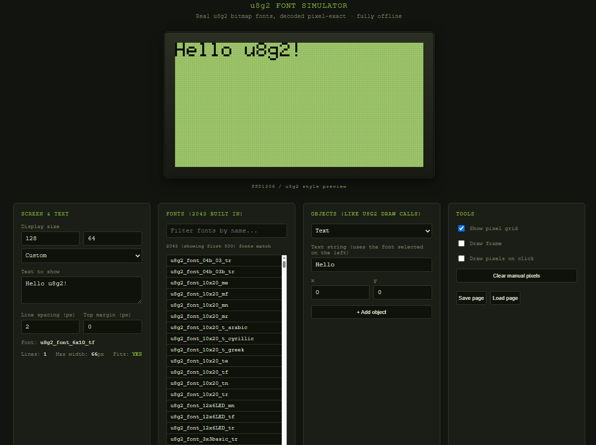

# u8g2 Font Simulator

A single-file, fully offline HTML tool for laying out text and simple
graphics on a simulated monochrome LCD (SSD1306-style), using **real u8g2
font bitmaps** — not approximations.

Built for testing [u8g2](https://github.com/olikraus/u8g2) fonts and
layouts before flashing them to real hardware (Arduino, ESP32, STM32, etc.).



## Why

u8g2 fonts are stored as compressed bitmap data compiled into your firmware.
Picking the right font/size/layout for a small screen usually means
flashing, looking, and re-flashing. This tool decodes the *actual* u8g2 font
format in the browser, so you can build and preview a pixel-exact screen
before touching hardware.

## Features

- **All 2043 u8g2 fonts**, embedded and decoded pixel-exact (no external
  font files, no network calls — works fully offline once downloaded).
- **Real decoder**, ported line-by-line from u8g2's own `u8g2_font.c`, not a
  visual approximation.
- **Any screen size** — presets for 128x64, 128x32, 96x16, 72x40, 64x48,
  256x64, 240x240, or type your own width/height.
- **Searchable, favoritable font list** — filter by name, star your
  favorites (☆/★) and filter to favorites only, or focus the list and use
  ↑ / ↓ to step through matches. When you're not searching, fonts are
  grouped by family (e.g. all `ncenB` sizes together, all `logisoso` sizes
  together) instead of one flat alphabetical wall of 2043 names.
- **Text objects** — build the whole screen from several independent
  sentences. Each one has its own live-editable sentence, x, y, and font —
  no button needed, changes apply as you type. To change a text object's
  font from the font list: click into any of its fields (it gets a green
  outline), then click a font in the Fonts card — it applies instantly.
- **Drawing objects** — Line, Rect outline, Rect filled, Circle, and Single
  pixel, similar to u8g2's `drawLine` / `drawFrame` / `drawBox` /
  `drawCircle` / `drawPixel`. Reorder with ▲ ▼, remove with ×.
- **Manual pixel drawing** — click (or drag) directly on the simulated
  screen to toggle individual pixels, like a tiny bitmap editor.
- **Autosaving workstation** — every change is saved in your browser as you
  work. Close the tab, reopen the file later, everything is still there.
- **Save / Load to file** — export the whole workstation (screen size,
  objects, favorites, manual pixels) to a `.json` file, and reload it later
  or on another computer.

## Usage

1. Download `u8g2_font_simulator.html` (or clone this repo).
2. Open the file in any modern browser. No server, no build step, no
   internet connection needed.
3. Pick a font from the list (search, browse by family, or star favorites).
4. Add text objects and drawing objects, or draw pixels directly, to build
   up the screen.
5. Once you're happy with a font, copy its exact name (shown under
   **Active font:**, or in each text object's font field) into your
   firmware code:

   ```cpp
   u8g2.setFont(u8g2_font_6x10_tf);
   u8g2.drawStr(0, 10, "Hello u8g2!");
   ```

## How the font decoding works

u8g2 fonts use a custom run-length-encoded bitmap format (documented on the
[u8g2 wiki](https://github.com/olikraus/u8g2/wiki/u8g2fontformat)). This
project embeds the actual compressed byte arrays from u8g2's
`csrc/u8g2_fonts.c` and includes a JavaScript decoder ported from
`csrc/u8g2_font.c`, so every glyph you see here is exactly what would be
drawn on real hardware — not a substitute font or a rasterized approximation.

## Project structure

```
u8g2_font_simulator.html   # the whole app: markup, decoder, font data, UI logic
```

Everything lives in one file on purpose — download it once, and it keeps
working offline forever, with no dependency on this repo staying online.

## Credits

- Font data and font format: [olikraus/u8g2](https://github.com/olikraus/u8g2)
  (see its repository for font licenses — most are BSD/X11/OFL, check
  individual font headers in u8g2 for exact terms).
- This simulator is an independent tool and is not affiliated with the u8g2
  project.

## License

MIT for the simulator code in this repository. Embedded font data retains
its original licensing from the u8g2 project.
